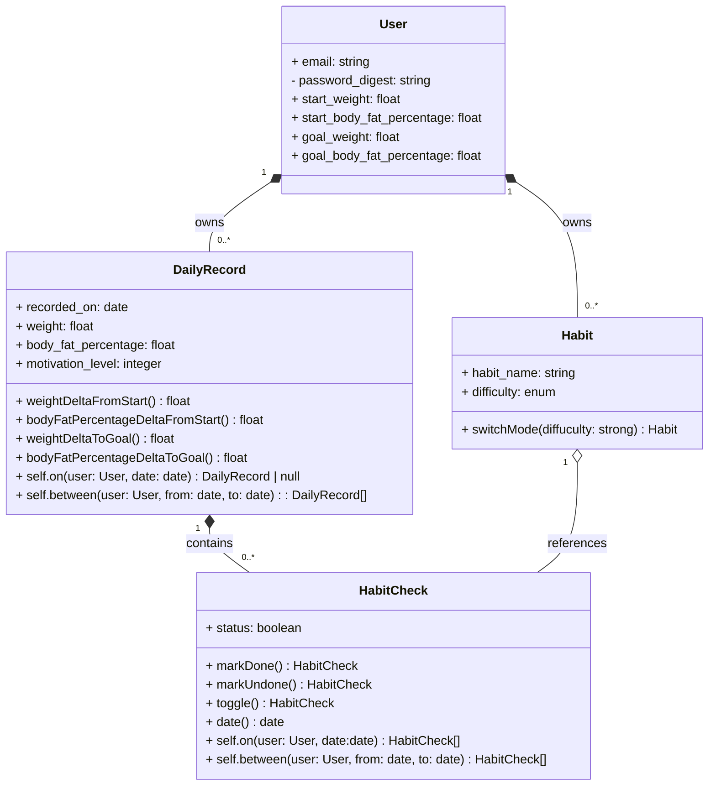
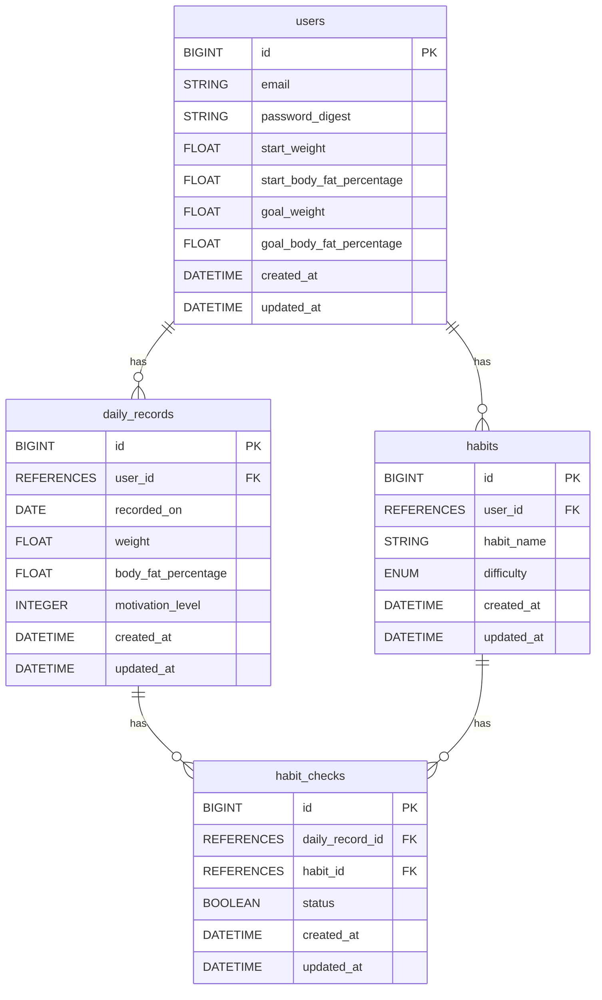

# [MyHabit](https://myhabit.onrender.com)

## 目的・概要
このアプリはダイエットの習慣化を目的としています。主な機能としては、体重記録と習慣トラッカーの機能があります。また、 日々の体重推移と自身が設定したダイエット習慣の達成度をグラフで可視化できます。このような各種機能により、日々のモチベーションを維持することを狙いにしています。

## 作成の動機
アプリ作成の動機は、自分自身や周囲の友人の「ダイエットを継続できない」という課題を解決したいと思ったことです。継続できない理由は、ダイエットのための行動と結果が結びついている感覚がないことであると友人からのヒアリングで分かりました。したがって、ダイエットを継続するための仮説は、体重推移と日々の努力が紐づく感覚をユーザーが得ることだと考えました。

## 他サービスとの差別化
既存のダイエット系アプリは、体重記録アプリか習慣トラッカーアプリに二極化されており、両方の機能を兼ね備えたアプリは少ないことに気づきました。また、ダイエットや健康維持のために習慣化したいことは人それぞれ異なりますが、既存アプリは習慣化したいことがプリセットされているものが大半です。
これらを踏まえて、本アプリでは以下の機能を設定しました。

## 具体の機能
体重・体脂肪率・モチベーション記録
ユーザーがオリジナルで習慣を設定
習慣トラッカー
体重推移と日々の習慣達成率のグラフによる可視化

## 使用技術
| カテゴリー | 使用技術 |
|-|-|
| バックエンド | Ruby on rails 7, PostgreSQL |
| フロントエンド | Tailwind CSS, Chart.js |
| 認証・認可 |Devise|
| 環境・デプロイ | Docker, Render |

## ゲストログイン機能
アプリを簡単に試すことができるゲストログイン機能を実装しています。

### 使い方
1. ログイン画面にアクセス
2. 「ゲストとしてログイン」ボタンをクリック
3. サンプルデータを含むゲストユーザーアカウントでログインできます

ゲストユーザー情報：
- Email: guest@example.com
- Password: password

サンプルデータには以下が含まれます：
- 5つの習慣（筋トレ、ランニング、野菜を食べる、読書、早起き）
- 過去30日分の体重・体脂肪率記録
- 過去30日分の習慣チェック記録

## クラス図

## ER図

## 画面遷移図
<a>https://www.figma.com/design/pAKAMTt95chcodONtKNgnm/MyHabit?node-id=48-2632&t=ctPsqubs1iSJ24Aw-1</a>
